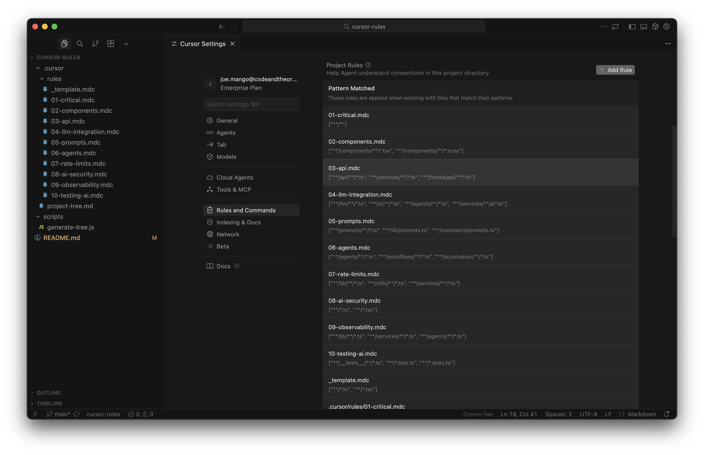

# Cursor Rules Starter Kit

> *"No, for the 47th time, we use Zustand not Redux. And yes, the API routes are in `/api/v2/`. And NO, we don't use semicolons here."*
> 
> — You, mass quitting chats, mass dying inside

---

**The Problem:** Every new chat is a blank slate. Your AI assistant has the memory of a mass GPT lobotomy goldfish. It doesn't know your stack, your patterns, your opinions on tabs vs spaces, or that one cursed legacy folder everyone pretends doesn't exist.

**The Solution:** Cursor Rules. Write it once, never explain it again. Every new chat starts *already knowing* how you do things around here.

This starter kit gives you:
- 📋 **Ready-to-use rule templates** for components, APIs, LLM integrations, and more
- 🎯 **Smart glob patterns** so rules only load when relevant
- 🌳 **Project tree generator** so Cursor always has the lay of the land
- 🧠 **A framework for growing your rules** as your project evolves

Stop repeating yourself. Start shipping.

## Quick Start

1. **Copy to your project:**
   ```bash
   cp -r ~/Desktop/cursor-rules/.cursor /path/to/your/project/
   cp ~/Desktop/cursor-rules/scripts/generate-tree.js /path/to/your/project/scripts/
   ```

2. **Add the npm script** to your `package.json`:
   ```json
   {
     "scripts": {
       "tree": "node scripts/generate-tree.js"
     }
   }
   ```

3. **Generate the project tree:**
   ```bash
   npm run tree
   ```

4. **Customize the rules** in `.cursor/rules/` for your project

5. **Done!** Cursor automatically loads rules based on file context

> 💡 **Pro tip:** Open **Cursor Settings → Rules** to see all your project rules in one place. They appear automatically—no manual registration needed.

---

## How Cursor Rules Work

### Auto-Discovery

Cursor automatically detects all `.mdc` files in your `.cursor/rules/` folder and displays them in **Settings → Rules and Commands → Project Rules**:



From here you can:

- See all your project rules and their glob patterns at a glance
- Click any rule to view/edit its contents
- See which rules are "Pattern Matched" for the current file

No configuration required—just drop files in the folder and they appear.

### Folder Structure

```
your-project/
└── .cursor/
    ├── project.yaml              # 🆕 Project-specific variables
    └── rules/
        ├── _template.mdc         # Copy this for new rules
        ├── 00-project-context.mdc # 🆕 Loads project.yaml context
        ├── 01-critical.mdc       # Core rules (always active)
        ├── 02-components.mdc     # Component patterns
        ├── 03-api.mdc            # API/backend patterns
        ├── 04-llm-integration.mdc # LLM client & streaming
        ├── 05-prompts.mdc        # Prompt engineering
        ├── 06-agents.mdc         # Agent & workflow patterns
        ├── 07-rate-limits.mdc    # Retry & rate limiting
        ├── 08-ai-security.mdc    # AI security patterns
        ├── 09-observability.mdc  # Logging & tracing
        ├── 10-testing-ai.mdc     # Testing AI features
        ├── 11-ralph-loops.mdc    # Autonomous agent loops
        └── 12-session-handoff.mdc # 🆕 Session health & handoffs
```

### File Format (`.mdc`)

Every rule file has two parts:

```markdown
---
globs: ["**/*.ts", "**/*.tsx"]    ← When to load this rule
---

# Rule Title                      ← Markdown content

Your rules and examples here...
```

---

## Project Context System

> "Edit one file, and every rule knows your stack."

The **project context system** lets you define project-specific variables that all rules can reference. Instead of editing every rule for each project, you edit one file.

### Setup

1. Edit `.cursor/project.yaml` with your project details:

```yaml
project:
  name: "My E-commerce App"
  type: "web-app"

stack:
  framework: "Next.js"
  styling: "Tailwind"
  database: "PostgreSQL"
  orm: "Prisma"

conventions:
  components: "PascalCase"
  state_management: "zustand"

preferences:
  test_framework: "vitest"
  commit_style: "conventional"
```

2. The `00-project-context.mdc` rule automatically loads this at session start.

### What You Can Configure

| Section | Purpose | Example Values |
|---------|---------|----------------|
| `project` | Identity & type | name, description, web-app/api/cli |
| `stack` | Tech stack | framework, styling, database, ORM |
| `directories` | Folder structure | src, components, api paths |
| `conventions` | Code style | naming, quotes, indentation |
| `ai` | LLM settings | provider, models, patterns |
| `preferences` | Team preferences | testing, git, docs |
| `notes` | Free-form context | Custom instructions |

### How It Works

When the AI starts a session, it reads `project.yaml` and adapts:

- **Creating components?** → Uses your naming convention and styling system
- **Writing tests?** → Uses your test framework (vitest/jest)
- **Making commits?** → Follows your commit style (conventional/gitmoji)
- **Placing files?** → Uses your directory structure

The rules stay generic—the context makes them specific.

---

## Session Health & Handoff

> "Know when to start fresh, and pick up exactly where you left off."

Long chat sessions degrade in quality. The **session handoff system** helps you:

1. **Recognize** when a fresh chat would help
2. **Generate** a handoff command to continue seamlessly

### Warning Signs

The AI will suggest a new chat when it detects:

| Signal | What It Looks Like |
|--------|-------------------|
| 🔴 Error loops | Same error 3+ times despite fixes |
| 🔴 Context confusion | Mixing up files, forgetting decisions |
| 🔴 Conflicting changes | Undoing previous edits |
| 🟡 Scope creep | Task expanded way beyond original |
| 🟡 Long conversation | 20+ exchanges |

### Handoff Command

When starting fresh, the AI generates a handoff block:

```markdown
## 🔄 Session Handoff

### Completed
- [x] Set up authentication
- [x] Created login page

### Next Steps
1. Create profile API endpoint
2. Connect profile component

### Resume Command
Continue auth implementation. Done: login/signup. 
Next: profile API at `/api/user/profile`.
Key files: `user-profile.tsx`, `middleware.ts`
```

Copy this into your new chat to continue without losing context.

### Trigger Phrases

Say any of these to get a handoff:
- "Let's continue in a new chat"
- "Generate a handoff"
- "Create a checkpoint"
- "Summarize for next session"

---

## Glob Patterns

The `globs` array controls **when** rules are loaded:

| Pattern | When It Applies |
|---------|-----------------|
| `["**/*"]` | All files (always active) |
| `["**/*.ts", "**/*.tsx"]` | TypeScript files |
| `["**/*.scss", "**/*.css"]` | Style files |
| `["**/components/**/*"]` | Only in components folder |
| `["**/api/**/*.ts"]` | Only API route files |

### Pattern Syntax

| Symbol | Meaning | Example |
|--------|---------|---------|
| `*` | Any chars (not `/`) | `*.ts` → all .ts files |
| `**` | Any path depth | `**/utils/**` → any utils folder |
| `{a,b}` | Either a or b | `*.{ts,tsx}` → .ts or .tsx |
| `[abc]` | Any of a, b, c | `file[123].ts` → file1.ts, file2.ts... |

---

## Creating Rules

### 1. Copy the template

```bash
cp .cursor/rules/_template.mdc .cursor/rules/04-my-rule.mdc
```

### 2. Set appropriate globs

```yaml
---
globs: ["**/hooks/**/*.ts"]  # Only for hook files
---
```

### 3. Write clear rules with examples

```markdown
## Always Do This

```typescript
// Good
const data = await fetchData();

// Bad - never do this
const data = fetch(); // missing await
```
```

---

## Best Practices

1. **One topic per file** - Keep rules focused
2. **Use specific globs** - Don't load irrelevant rules
3. **Show code examples** - Concrete > abstract
4. **Number your files** - `01-`, `02-` keeps order consistent
5. **Keep it concise** - AI context is limited

---

## Included Templates

### Core Rules

| File | Purpose | Default Globs |
|------|---------|---------------|
| `_template.mdc` | Blank starter | `**/*.ts, **/*.tsx` |
| `00-project-context.mdc` | **Loads project.yaml context** | `**/*` (always) |
| `01-critical.mdc` | Core rules (style, imports, errors) | `**/*` (always) |
| `02-components.mdc` | UI component patterns | `**/components/**/*` |
| `03-api.mdc` | API & service patterns | `**/api/**/*`, `**/services/**/*` |

### AI/LLM Rules (for automation & AI-powered apps)

| File | Purpose | Default Globs |
|------|---------|---------------|
| `04-llm-integration.mdc` | LLM client setup, streaming, structured outputs | `**/llm/**/*`, `**/ai/**/*` |
| `05-prompts.mdc` | Prompt engineering, templates, versioning | `**/prompts/**/*` |
| `06-agents.mdc` | Agent loops, tools, workflows | `**/agents/**/*`, `**/workflows/**/*` |
| `07-rate-limits.mdc` | Retry logic, rate limiters, queues | `**/lib/**/*`, `**/utils/**/*` |
| `08-ai-security.mdc` | Prompt injection, sanitization, API keys | `**/*.ts, **/*.tsx` |
| `09-observability.mdc` | Logging, tracing, cost tracking | `**/lib/**/*`, `**/services/**/*` |
| `10-testing-ai.mdc` | Mocking LLMs, evals, integration tests | `**/__tests__/**/*`, `**/*.test.ts` |

### Workflow Rules

| File | Purpose | Default Globs |
|------|---------|---------------|
| `11-ralph-loops.mdc` | Autonomous agent loops for mass refactors | `**/*` (always) |
| `12-session-handoff.mdc` | **Session health monitoring & handoffs** | `**/*` (always) |

---

## Project Tree Generator

The `project-tree.md` file gives Cursor a bird's-eye view of your codebase structure.

### Setup

1. Copy the script:
   ```bash
   mkdir -p scripts
   cp ~/Desktop/cursor-rules/scripts/generate-tree.js scripts/
   ```

2. Add to `package.json`:
   ```json
   {
     "scripts": {
       "tree": "node scripts/generate-tree.js"
     }
   }
   ```

3. Generate:
   ```bash
   npm run tree
   ```

### What It Does

- Generates a tree view of your project structure
- Auto-detects common directories (components, hooks, services, etc.)
- Ignores `node_modules`, `.git`, build artifacts, etc.
- Summarizes large folders (icons, tests) with file counts
- Outputs to `.cursor/project-tree.md`

### When to Regenerate

Run `npm run tree` after:
- Adding new major directories
- Significant file structure changes
- Before starting a new feature (to refresh context)

### Customization

Edit `scripts/generate-tree.js` to:

```javascript
// Add directories to ignore
const IGNORE_DIRS = new Set([
  'node_modules',
  '.git',
  // Add your own...
]);

// Add directories to summarize (show count only)
const SUMMARIZE_DIRS = new Set([
  'icons',
  '__tests__',
  // Add your own...
]);

// Adjust tree depth
const MAX_DEPTH = 6;
```

---

## Troubleshooting

**Rules not loading?**

- [ ] File has `.mdc` extension
- [ ] File is in `.cursor/rules/` folder
- [ ] Frontmatter uses valid YAML
- [ ] Glob pattern matches your file
- [ ] Try restarting Cursor

**Rules too broad?**

- Use more specific glob patterns
- Split into multiple focused files

**Tree not generating?**

- [ ] Script exists at `scripts/generate-tree.js`
- [ ] `npm run tree` script added to package.json
- [ ] Run from project root directory
